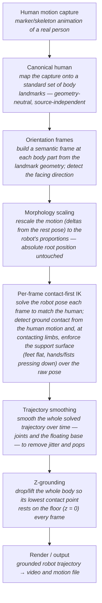

# Retargeting pipeline — process flow

Human motion → canonical human → scaling → per-frame IK → smoothing → grounding → render.

Conventions: +X forward / +Y left / +Z up · quaternions wxyz.

## The idea, step by step
1. **Human motion capture** — the raw performance of a real person.
2. **Canonical human** — re-express that motion on a standard skeleton of body
   landmarks, so everything downstream is independent of the capture source.
3. **Orientation frames** — derive an orientation for each body part from the
   landmark *positions* (not the raw capture rotations), and find which way the
   person faces.
4. **Morphology scaling** — adapt the human-sized motion to the robot's limb
   proportions, scaling only the movement away from a rest pose so the robot
   isn't teleported.
5. **Per-frame contact-first IK** — for each frame, solve the robot's joints to
   follow the human. Where the human is touching the ground, that contact takes
   priority: the foot is held flat, a supporting hand/fist is pressed down, and
   the limb is free to bend however the contact needs.
6. **Trajectory smoothing** — treat the whole clip at once and smooth it in time
   (both the joints and the free base) to kill per-frame jitter and pops.
7. **Z-grounding** — shift the body vertically so its lowest point sits on the
   floor, so the robot is planted rather than floating or sinking.
8. **Render / output** — produce the final video and the grounded motion.
